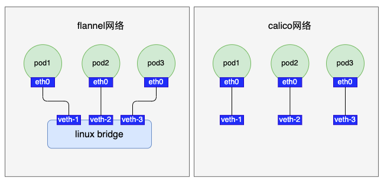
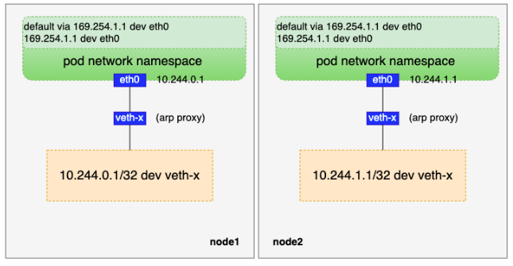

kubernetes对容器网络一般有如下要求：

- **`所有pod都可以在不使用NAT的情况下与其它pod通信`**
- **`所有节点都可以在没有NAT的情况下与其它pod通信`**
- **`pod看到自己的IP和其它pod看到的IP是相同的`**

基于以上几点，我们尝试从整体到细节递进，实现一个自己的CNI网络。首先，我们看看这个CNI网络的大致模型：


# 容器网络

实现一个kubernetes容器网络，一般来说需要考虑以下几点：

- **`pod IP规划`**
- **`pod网络命名空间的初始化`**
- **`pod流量如何到达宿主机`**
- **`宿主机流量如何进入pod`**
- **`跨宿主机的pod如何通信`**

接下来我们分别对这几点做细化说明。

##### pod IP规划

pod IP规划其实是一个比较复杂的话题，基于集群实例规模、实际业务需求（比如某些场景有固定IP需求，或者需要支持多VPC多子网等）、pod IP是否对外暴露（集群外直接通过pod IP访问pod）等需求可能会有不同的考虑。

出于简单原则，我们借助kubernetes原生支持的功能来规划本文的容器网络。首先，我们给controller-manager增加两个参数并重启：

- `--allocate-node-cidrs=true`:开启节点分配网段功能
- `--cluster-cidr=10.244.0.0/16`:指定集群pod的IP网段为10.244.0.0/16

重启controller-manager后，每个节点都会在10.244.0.0/16（注意掩码是16位）这个大网段内分配到一个小网段，例如node1分配10.244.0.0/24，node2分配10.244.1.0/24（注意掩码是24位），这个网段数据会被设置到对应node对象的spec.podCIDR字段中。
```shell
# ps -ef | grep controller-manager | grep -E "allocate-node-cidrs|cluster-cidr"
root      2091  2054  0 4月23 ?       03:17:48 kube-controller-manager --allocate-node-cidrs=true --authentication-kubeconfig=/etc/kubernetes/controller-manager.conf --authorization-kubeconfig=/etc/kubernetes/controller-manager.conf --bind-address=127.0.0.1 --client-ca-file=/etc/kubernetes/pki/ca.crt --cluster-cidr=10.244.0.0/16 --cluster-signing-cert-file=/etc/kubernetes/pki/ca.crt --cluster-signing-key-file=/etc/kubernetes/pki/ca.key --controllers=*,bootstrapsigner,tokencleaner --kubeconfig=/etc/kubernetes/controller-manager.conf --leader-elect=true --node-cidr-mask-size=24 --requestheader-client-ca-file=/etc/kubernetes/pki/front-proxy-ca.crt --root-ca-file=/etc/kubernetes/pki/ca.crt --service-account-private-key-file=/etc/kubernetes/pki/sa.key --use-service-account-credentials=true
# kubectl get node
NAME              STATUS   ROLES    AGE   VERSION
vm-12-11-centos   Ready    <none>   31d   v1.15.0
vm-12-7-centos    Ready    master   31d   v1.15.0
# kubectl get node vm-12-11-centos -o json | jq .spec.podCIDR
"10.244.1.0/24"
# kubectl get node vm-12-7-centos -o json | jq .spec.podCIDR
"10.244.0.0/24"
```

##### pod网络命名空间的初始化

在[《从零到一实现一个CNI（上）》](https://mp.weixin.qq.com/s/VhCXLt6WbPHcnlokQRbbug)一文中，我们通过对containerd CRI sandbox网络（也就是pod网络）的源码分析，知道了CRI在调CNI插件时，只提供了一个网络命名空间（即pod网络命名空间）、（kubernetes层面）pod命名空间、pod名称、CNI配置文件等数据，CNI插件的职责就是要基于这些数据去初始化好这个网络命名空间。

本文的pod和宿主机属于不同的网络命名空间（pod配置hostNetwork时属于同一网络命名空间，但不在本文讨论范围之内），pod访问其它宿主机上的pod时，数据包最终肯定是从宿主机的物理网卡上出去的，而宿主机的物理网卡属于宿主机root网络命名空间的资源，因此我们需要考虑pod网络命名空间和宿主机root网络命名空间的通信。

针对同一主机上不同网络命名空间的通信，最常用的技术就是veth pair（参考[《浅谈veth pair》](https://mp.weixin.qq.com/s/az7tdDYTqtcV5JRMA8Lh8w)），veth pair的两端分别放在pod和宿主机root网络命名空间。

于是，CNI插件初始化CRI给的网络命名空间包括：

- **`创建veth pair`**

创建一个veth pair，其中一端命名为eth0（必须，containerd CRI会校验），另一端可自行命名。我们可以对pod命名空间和名称做个sha1加密，同时加上一个前缀（如`veth-`）并考虑数据长度，取前面一段作为自行命名的那端的名称，（go语言，下同）示例代码如下：
```go
func vethNameForWorkload(podNamespace, podname string) string {
    h := sha1.New()
    h.Write([]byte(fmt.Sprintf("%s.%s", namespace, podname)))
    return fmt.Sprintf("veth-%s", hex.EncodeToString(h.Sum(nil))[:11])
}
```
veth pair两端名称确定后，我们用如下示例代码创建veth pair：
```go
import "github.com/vishvananda/netlink"

hostVethName := vethNameForWorkload(podNamespace, podName)

netlink.LinkAdd(&netlink.Veth{
    LinkAttrs: netlink.LinkAttrs{
        Name: “eth0”,
        MTU:  1500,
    },
    PeerName: hostVethName,
})
```

- **`veth pair的eth0端放入pod网络命名空间，另一端放在宿主机root网络命名空间`**

这一步与上一步有关，如果上一步的代码是在宿主机root网络命名空间执行的，那么需要把eth0放入到pod网络命名空间中；如果上一步代码是在pod网络命名空间执行的，那么需要把veth-x这端放到宿主机root网络命名空间。这里以第二种情况为例给出示例代码：
```go
import "github.com/containernetworking/plugins/pkg/ns"

// 该函数在pod网络命名空间执行
ns.WithNetNSPath(podNetns, func(hostNS ns.NetNS) error {
    /*创建veth pair等操作*/

    // 创建veth pair后根据hostVethName查找宿主机这端的veth
    hostVeth, err := netlink.LinkByName(hostVethName)
    if err != nil {
        err = fmt.Errorf("failed to lookup %q: %v", hostVethName, err)
        return err
    }
    
    // 把hostVeth放到宿主机root网络命名空间
    if err = netlink.LinkSetNsFd(hostVeth, int(hostNS.Fd())); err != nil {
        return fmt.Errorf("failed to move veth to host netns: %v", err)
    }
    
    /*其它逻辑*/
}
```

- **`给pod申请IP`**

网络层面把负责IP地址管理的地方叫作IPAM（IP Address Management），在`pod IP规划`一章节中我们给每个节点都分配了一个地址互不重叠的网段，于是可以给每个节点配置一个独立的IPAM来管理本节点上的IP资源。IPAM的实现不在本文讨论范围内，本文采用社区提供的一个实现：`host-local`（源码地址：[https://github.com/containernetworking/plugins/tree/main/plugins/ipam/host-local](https://github.com/containernetworking/plugins/tree/main/plugins/ipam/host-local)，源码分析可以参考：([《host-local源码分析》](https://editor.csdn.net/md/?articleId=124550431))）。
>Note:
>
>host-local是一个可执行程序，部署的时候需要放到CNI bin程序目录，即放到`/opt/cni/bin`。

向host-local这个IPAM申请IP示例代码如下：
```go
import (
    "github.com/containernetworking/cni/pkg/types"
    "github.com/containernetworking/plugins/pkg/ipam"
    "github.com/containernetworking/plugins/plugins/ipam/host-local/backend/allocator"
)

func getPodIP() (types.Result, error) {
    ipamConf := allocator.Net{
        Name:       conf.Name,
        CNIVersion: conf.CNIVersion,
        IPAM: &allocator.IPAMConfig{
            Type: "host-local",
            Ranges: []allocator.RangeSet{
                {
                    {
                        Subnet: "10.244.x.0/24", // 注意这里是24位掩码
                    },
                },
            },
        },
    }
    ipamConfBytes, err := json.Marshal(ipamConf)
    if err != nil {
        return nil, errors.Wrapf(err, "marshal ipam conf error")
    }

    return ipam.ExecAdd("host-local", ipamConfBytes)
}
```

- **`把申请的IP配置到veth pair的eth0`**

从IPAM申请到IP后，把该IP配置到veth pair的eth0端，这一端在pod网络命名空间内，这个IP也就是pod的IP（`veth pair的另一端无需配置IP`）。示例代码如下：
```go
import "github.com/vishvananda/netlink"

// 注意这里eth0掩码设置为32位，防止系统自动生成一条路由
netlink.AddrAdd(eth0, &ntlink.Addr{IPNet: "x.x.x.x/32"})
```

- **`up veth pair两端`**

准备好veth pair后，记得up veth pair两端：
```go
import "github.com/vishvananda/netlink"

// pod网络命名空间执行
netlink.LinkSetUp(eth0)

// 宿主机root网络命名空间执行
netlink.LinkSetUp(veth-x)
```

##### pod流量如何到达宿主机

对于这个问题，不同的网络方案有不同的处理，例如flannel会把veth-x插到宿主机root网络命名空间的一个网桥上，而calico则是直接放在宿主机上：



出于简单考虑，我们选择calico这种直接把veth pair的一端放在宿主机上的方案。这里有个比较关键的知识点：`arp proxy`：
>calico为了简化网络配置，会在pod网络命名空间内添加一条网关是169.254.1.1（预留的本地网段IP，实际中并不存在某个网络设备IP是它）的默认路由。这样将pod内的默认路由都设置成了一样，不需要动态更新，即pod网络命名空间的路由为：
>```shell
># ip route
>default via 169.254.1.1 dev eth0
>169.254.1.1 dev eth0
>```
>在pod网络命名空间内添加了网关是169.254.1.1的默认路由后，容器会查询下一跳（即169.254.1.1）的MAC地址，这个ARP请求从pod网络命名空间内通过eth0到达宿主机上veth pair的另一端veth-x。veth-x只有MAC地址没有IP，收到这个ARP请求后会怎么处理呢？答案是veth-x直接应答，返回自己的MAC地址，后续pod网络命名空间报文IP还是目的IP，但是MAC地址都变成了主机上veth-x的MAC地址，也就是pod网络命名空间出来的报文都会发给主机网络，主机再根据目的IP地址进行转发。
>
>veth-x不管ARP请求内容直接返回自己MAC地址做应答的行为称为“`ARP proxy`”，可通过把 `echo 1 > /proc/sys/net/ipv4/conf/veth1/proxy_arp` 来开启该功能。

所以这个方案需要做如下处理：

- **`pod网络命名空间配置路由`**

`pod网络命名空间`配置默认路由示例代码如下：
```go
import "github.com/vishvananda/netlink"

// 添加169.254.1.1 dev eth0路由
netlink.RouteAdd(&netlink.Route{
    LinkIndex: eth0Index,
    Scope:     netlink.SCOPE_LINK,
    Dst:       "169.254.1.1/32",
})

// 添加default via 169.254.1.1 dev eth0路由
netlink.RouteAdd(&netlink.Route{
    LinkIndex: eth0Index,
    Scope:     netlink.SCOPE_LINK,
    Dst:       "0.0.0.0/0",
    Gw:        "169.254.1.1",
})
```

- **`veth-x配置arp proxy`**

在宿主机root网络命名空间给veth-x开启arp proxy：
```go
func writeProcSys(path, value string) error {
    f, err := os.OpenFile(path, os.O_WRONLY, 0)
    if err != nil {
        return err
    }
    n, err := f.Write([]byte(value))
    if err == nil && n < len(value) {
        err = io.ErrShortWrite
    }
    if err1 := f.Close(); err == nil {
        err = err1
    }
    return err
}
 
writeProcSys(fmt.Sprintf("/proc/sys/net/ipv4/conf/%s/proxy_arp", veth-x), "1")
```

##### 宿主机流量如何进入pod

因为我们在前面把veth pair的veth-x一端直接放在了宿主机root网络命名空间，我们可以针对每个veth-x配置一条路由使得宿主机的流量能进入pod网络命名空间：


对应的示例代码如下：
```go
import "github.com/vishvananda/netlink"
 
netlink.RouteAdd(&netlink.Route{
    LinkIndex: veth-xIndex,
    Scope:     netlink.SCOPE_UNIVERSE,
    Dst:       podIP,
})
```

到这里，我们打通了pod网络命名空间和宿主机root网络命名空间的通信：




##### 跨宿主机的pod如何通信

在我们前面的准备中，不同宿主机之间的pod目前是无法直接通信的。解决容器跨宿主机通信问题，从报文封包的角度可以分为两类：

- **`underlay`** ：直接基于物理网络发送数据报文。常见的underlay网络有flannel host-gateway模式、calico BGP模式等。underlay网络性能上比较优异，但是一般要求`节点间网络二层互通`。

- **`overlay`** ：用额外的协议对原始数据报文进行封装再发送出去，常见的overlay网络有flannel vxlan模式、calico IPIP模式等。相比于underlay网络，overlay网络有了封解包的操作，在性能上会差一些，但是overlay网络一般要求`节点间三层互通`即可。

考虑到我当前环境不满足节点间二层互通（事实上，云上的机器一般比较难满足二层互通，特别是公有云），我们借助vxlan隧道来打通节点间的通信，在实现方式上也参考flannel vxlan模式的逻辑（flannel vxlan模式可参考[《flannel VXLAN模式的实现》](https://mp.weixin.qq.com/s/FcwXmOaZdeEv0kOEEYjhcw)）。先简单回顾下flannel vxlan模式原理：

>flannel vxlan模式的最主要的特点是基于vxlan隧道打通了不同节点间的容器网络，而vxlan隧道原理是MAC in UDP的overlay网络，即把内层pod原始报文封装成UDP数据包发出去。

在前面的`pod IP规划章节`我们给每个节点分配了一个小网段，基于这个规则，为了让数据报文经过本机vxlan设备的封包和对方vxlan设备的解包，我们可以在宿主机上添加如下路由：
```
// 10.244.x.0/24是分配给对方节点的网段，也就是这个网段的数据包都发给对方节点的vxlan设备处理
10.244.x.0/24 gw $remoteVxlanIP dev $localVxlanDev onlink
```
有了这条路由后，我们便有了vxlan通信的基础。不过还有两个问题需要解决：

- **`如何知道对方vxlan设备的MAC？`**
- **`如何知道对方vxlan设备对应的宿主机IP？`**

对于第一个问题，我们从路由网关中拿到了对方vxlan设备的IP，根据IP查询MAC很容易想到ARP，于是我们可以维护一条arp记录：
```
$remoteVxlan IP lladdr $remoteVxlanMac PERMANENT
```
根据对方MAC找对应的宿主机IP，则可以通过fdb表项：
```
$remoteVxlanMac dst $remoteHostIP self PERMANENT
```

有了以上的准备我们才能真正的打通节点间的vxlan隧道，但是还缺少一个最基础的环节：对方pod网段、vxlan设备IP、vxlan设备MAC、宿主机IP又如何拿到呢？只有先拿到这些数据才能维护到本机的相关表项中。

其实这个也简单，只需要每个节点初始化好本机vxlan设备后把相关信息上报到一个全局的“配置中心”，同时监听其它节点上报上来的数据。我们重新梳理下完整的打通vxlan隧道步骤：

- **`创建vxlan设备`**

在创建vxlan设备前，我们需要先准备一些数据：

1. vxlan设备的VNI、名称、MTU、UDP端口号

VNI是用来区分vxlan段的，只有VNI相同的vxlan段才能相互通信，这里我们约定VNI默认为1；vxlan设备名称在不同节点上可以相同，因此我们可以定义某个前缀加上VNI值作为vxlan设备名称，例如vxlan.1；因为vxlan隧道对数据包做了封装，在内层报文的基础上加了50字节的头部数据，为了防止经过vxlan设备封包的数据因MTU被其它设备丢弃，我们把vxlan设备的MTU设置为一般设备默认MTU-50，即1500-50=1450；UDP端口号我们也约定好为8472。

2. vxlan设备的MAC

vxlan设备的MAC随机生成即可，示例如下：
```go
import "net"
 
func newHardwareAddr() (net.HardwareAddr, error) {
    hardwareAddr := make(net.HardwareAddr, 6)
    if _, err := rand.Read(hardwareAddr); err != nil {
        return nil, fmt.Errorf("could not generate random MAC address: %w", err)
    }
 
    // Ensure that address is locally administered and unicast.
    hardwareAddr[0] = (hardwareAddr[0] & 0xfe) | 0x02
 
    return hardwareAddr, nil
}
```

3. vxlan隧道出口设备信息

所谓的“出口设备”，指的是vxlan所在宿主机的物理网卡（hostDev），查询宿主机的物理网卡设备我们可以根据宿主机的默认路由（某些场景不一定准确）或者指定宿主机网卡。

于是创建vxlan设备有如下示例代码：
```go
hardwareAddr, _ := newHardwareAddr()
 
vxlanDev := &netlink.Vxlan{
    LinkAttrs: netlink.LinkAttrs{
        Name:         "vxlan.1",
        HardwareAddr: hardwareAddr,
        MTU:          1450,
    },
 
    VxlanId:      1,
    VtepDevIndex: hostDevID,
    SrcAddr:      hostDevIP,
    Port:         8472,
    Learning:     false,
}
 
netlink.LinkAdd(vxlanDev)
```

- **`给vxlan设备配置IP并up`**

我们很容易知道自身程序运行在哪个节点上，而节点对应的node对象spec.podCIDR字段中有网段信息，因此我们可以拿该网段的第一个IP作为vxlan设备的IP，示例代码如下：
```go
// 获取当前节点名称，先尝试从环境变量中获取，如果没有获取到，则再尝试通过pod命名空间和名称从pod对象中获取
func GetCurrentNodeName() (string, error) {
    nodeName := os.Getenv("NODE_NAME")
    if nodeName == "" {
        podName := os.Getenv("POD_NAME")
        podNamespace := os.Getenv("POD_NAMESPACE")
        if podName == "" || podNamespace == "" {
            return "", fmt.Errorf("env variables POD_NAME and POD_NAMESPACE must be set")
        }
 
        pod, err := clientSet.CoreV1().Pods(podNamespace).Get(context.Background(), podName, metav1.GetOptions{})
        if err != nil {
            return "", fmt.Errorf("error retrieving pod spec for '%s/%s': %v", podNamespace, podName, err)
        }
        nodeName = pod.Spec.NodeName
        if nodeName == "" {
            return "", fmt.Errorf("node name not present in pod spec '%s/%s'", podNamespace, podName)
        }
    }
 
    return nodeName, nil
}
 
// 获取当前节点对象
func GetCurrentNode() (*corev1.Node, error) {
    nodeName, err := GetCurrentNodeName()
    if err != nil {
        return nil, errors.Wrap(err, "GetCurrentNodeName error")
    }
 
    node, err := nodeLister.Get(nodeName)
    if err != nil {
        return nil, errors.Wrapf(err, "get node %s error", nodeName)
    }
 
    return node, nil
}
 
node, _ := k8s.GetCurrentNode()
 
// 解析node.spec.podCIDR字段
_, cidr, err := net.ParseCIDR(node.Spec.PodCIDR)
 
// 给vxlan设备配置IP
netlink.AddrAdd(vxlanDev, &netlink.Addr{
    IPNet: &net.IPNet{
        IP:   cidr.IP,
        Mask: net.IPv4Mask(255, 255, 255, 255),
    },
})
```

- **`本机vxlan信息上报`**

通过前面的步骤，我们拿到了vxlan设备的mac、IP信息以及对于宿主物理网卡IP等信息。为了让其它节点上的服务感知到本节点，我们可以把这些信息上报到etcd或者存到kubernetes对象中。这里我们把这些信息保存到对应node对象的annotation中，示例代码如下：
```go
func PatchNode(oldNode, newNode *corev1.Node) error {
    oldData, err := json.Marshal(oldNode)
    if err != nil {
        return errors.Wrap(err, "marshal old node error")
    }
 
    newData, err := json.Marshal(newNode)
    if err != nil {
        return errors.Wrap(err, "marshal new node error")
    }
 
    patchBytes, err := strategicpatch.CreateTwoWayMergePatch(oldData, newData, corev1.Node{})
    if err != nil {
        return errors.Wrap(err, "CreateTwoWayMergePatch error")
    }
 
    if _, err = clientSet.CoreV1().Nodes().Patch(context.Background(), oldNode.Name, types.StrategicMergePatchType, patchBytes, metav1.PatchOptions{}); err != nil {
        return errors.Wrap(err, "patch node error")
    }
 
    return nil
}
 
func uploadVxlanDeviceInfo(node *corev1.Node, vxlanDevice *netlink.Vxlan) error {
    newNode := node.DeepCopy()
    newNode.Annotations[mycniVtepMacAnnotationKey] = vxlanDevice.HardwareAddr.String()
    newNode.Annotations[mycniHostIPAnnotationKey] = vxlanDevice.SrcAddr.String()
 
    klog.Infof("mac: %s", vxlanDevice.HardwareAddr.String())
    klog.Infof("host ip: %s", vxlanDevice.SrcAddr.String())
 
    return PatchNode(node, newNode)
}
```

- **`监听其它节点vxlan设备信息`**

上一步我们把vxlan设备写入了node的annotation中，对于其它节点来说还需要一种机制可以感知到这些数据的变化。幸运的是，kubernetes的list-watch机制可以很好的用在这里，于是我们在node的informer中注册add、update、delete三种事件处理函数：
```go
import "k8s.io/client-go/tools/cache"
 
func InitNodeController(filter func(interface{}) bool, addFn, delFn func(interface{}), updateFn func(interface{}, interface{})) {
    nodeInformer.AddEventHandler(cache.FilteringResourceEventHandler{
        FilterFunc: filter,
        Handler: cache.ResourceEventHandlerFuncs{
            AddFunc:    addFn,
            UpdateFunc: updateFn,
            DeleteFunc: delFn,
        },
    })
}
```

我们只需要感知其他节点即可，因此在过滤函数中过滤自身节点：
```go
func filterNode(nodeName string) func(obj interface{}) bool {
    return func(obj interface{}) bool {
        node, ok := obj.(*coreV1.Node)
        if !ok {
            return false
        }

        // 不处理自己这个节点
        if nodeName == node.Name {
            return false
        }

        return true
    }
}
```

- **`维护本机路由、arp、fdb表项`**

add和update事件更新路由、arp、fdb表项逻辑是相同的，可以封装出来：
```go
func handlerAddOrUpdate(vxlanDevice *netlink.Vxlan, obj interface{}) error {
    // filter函数已对类型做了过滤，这里直接断言ok
    node := obj.(*coreV1.Node)
    _, ipnet, err := net.ParseCIDR(node.Spec.PodCIDR)
    if err != nil {
        return errors.Wrapf(err, "ParseCIDR %s error", node.Spec.PodCIDR)
    }

    vtepMacStr := node.Annotations[mycniVtepMacAnnotationKey]
    if vtepMacStr == "" {
        return errors.Wrapf(err, "node %s vtep mac is null", node.Name)
    }
    vtepMac, err := net.ParseMAC(vtepMacStr)
    if err != nil {
        return errors.Wrapf(err, "ParseMAC %s error", vtepMacStr)
    }

    hostIP := net.ParseIP(node.Annotations[mycniHostIPAnnotationKey])
    if hostIP == nil {
        return errors.Errorf("hostIP is nil")
    }

    if err = pkg.AddArp(vxlanDevice.Index, ipnet.IP, vtepMac); err != nil {
        return errors.Wrapf(err, "node %s add event AddARP error: %s", node.Name, err.Error())
    }
    klog.Infof("AddARP: arp -i %s -s %s %s", vxlanDevice.Name, ipnet.IP.String(), vtepMac.String())

    if err = pkg.AddFDB(vxlanDevice.Index, hostIP, vtepMac); err != nil {
        return errors.Wrapf(err, "node %s add event AddFDB error: %s", node.Name, err.Error())
    }
    klog.Infof("AddFDB: bridge fdb append %s dev %s dst %s", vtepMac.String(), vxlanDevice.Name, hostIP)

    if err = pkg.ReplaceRoute(vxlanDevice.Index, ipnet, ipnet.IP); err != nil {
        return errors.Wrapf(err, "node %s add event ReplaceRoute error: %s", node.Name, err.Error())
    }
    klog.Infof("ReplaceRoute: ip route add %s via %s dev %s onlink", ipnet.String(), ipnet.IP, vxlanDevice.Name)

    return nil
}

func nodeAddFn(vxlanDevice *netlink.Vxlan) func(obj interface{}) {
    return func(obj interface{}) {
        node := obj.(*coreV1.Node)
        klog.Infof("node add event: %s", node.Name)

        if err := handlerAddOrUpdate(vxlanDevice, obj); err != nil {
            klog.Errorf("handlerAddOrUpdate error: %s", err.Error())
            return
        }
    }
}

func nodeUpdateFn(vxlanDevice *netlink.Vxlan) func(oldObj, newObj interface{}) {
    return func(oldObj, newObj interface{}) {
        oldNode := oldObj.(*coreV1.Node)
        newNode := newObj.(*coreV1.Node)
        if oldNode.Annotations[mycniVtepMacAnnotationKey] == newNode.Annotations[mycniVtepMacAnnotationKey] {
            return
        }

        klog.Infof("node update event: %s", newNode.Name)
        if err := handlerAddOrUpdate(vxlanDevice, newObj); err != nil {
            klog.Errorf("handlerAddOrUpdate error: %s", err.Error())
            return
        }
    }
}
```

delete事件则是删除对应的路由、arp、fdb表项：
```go
func nodeDelFn(vxlanDevice *netlink.Vxlan) func(obj interface{}) {
    return func(obj interface{}) {
        // filter函数已对类型做了过滤，这里直接断言ok
        node := obj.(*coreV1.Node)
        _, ipnet, err := net.ParseCIDR(node.Spec.PodCIDR)
        if err != nil {
            klog.Errorf("ParseCIDR %s error", node.Spec.PodCIDR)
            return
        }

        vtepMacStr := node.Annotations[mycniVtepMacAnnotationKey]
        if vtepMacStr == "" {
            klog.Errorf("node %s vtep mac is null", node.Name)
            return
        }
        vtepMac, err := net.ParseMAC(vtepMacStr)
        if err != nil {
            klog.Errorf("ParseMAC %s error", vtepMacStr)
            return
        }

        hostIP := net.ParseIP(node.Annotations[mycniHostIPAnnotationKey])
        if hostIP == nil {
            klog.Errorf("%s: hostIP is nil", node.Name)
            return
        }

        klog.Infof("node delete event: %s", node.Name)
        if err = pkg.DelArp(vxlanDevice.Index, ipnet.IP, vtepMac); err != nil {
            klog.Errorf("node %s add event DelARP error: %s", node.Name, err.Error())
            return
        }
        klog.Infof("DelARP: arp -i %s -d %s", vxlanDevice.Name, ipnet.IP.String())

        if err = pkg.DelFDB(vxlanDevice.Index, hostIP, vtepMac); err != nil {
            klog.Errorf("node %s add event DelFDB error: %s", node.Name, err.Error())
            return
        }
        klog.Infof("DelFDB: bridge fdb del %s dev %s dst %s", vtepMac.String(), vxlanDevice.Name, hostIP)

        if err = pkg.DelRoute(vxlanDevice.Index, ipnet, ipnet.IP); err != nil {
            klog.Errorf("node %s add event DelRoute error: %s", node.Name, err.Error())
            return
        }
        klog.Infof("DelRoute: ip route del %s via %s dev %s", ipnet.String(), ipnet.IP, vxlanDevice.Name)
    }
}
```

到这里，我们得到了一个完整网络模型：


# 功能划分

前面我们详细分析了实现一个容器网络的细节，整体上可以分为两部分。一部分是与pod网络命名空间关系密切的，例如创建veth pair、申请IP等操作；另一部分是与pod网络命名空间关系关系不大的，例如打通vxlan隧道。第一部分对应的是CNI插件的职责，第二部分则是对应一般以daemonSet形式起的pod的职责。我们重新整理下本文的这些内容：

CNI插件职责：

- `创建veth pair，且veth pair一端命名为eth`
- `veth pair的eth0这端放到pod网络命名空间，另一端放在宿主机root网络命名空间`
- `申请IP，并把申请到的IP配置到veth pair的eth0`
- `up veth pair两端`
- `pod网络命名空间配置169.254.1.1的默认路由`
- `宿主机root网络命名空间的veth-x开启arp proxy`
- `针对每个pod IP在宿主机上配置一条入方向路由`

daemonSet pod职责：

- `准备好vxlan设备的VNI、名称、MTU、UDP端口等信息创建vxlan设备`
- `给vxlan设备配置IP并up vxlan设备`
- `本机vxlan设备信息，包括vxlan IP、MAC和宿主机IP，上报保存在对应node对象的annotation中`
- `informer监听node对象的add、update和delete事件，更新本机对应的路由、arp和fdb表项`

# 编译打包

完整的示例代码我放在了github上：[https://github.com/nuczzz/mycni](https://github.com/nuczzz/mycni)，有兴趣的读者可以参考着实践一下，目录如下：


cmd/plugin对应的是上一章节提到的CNI插件入口，cmd/mycni则是对应daemonSet pod逻辑入口。CNI插件编译成可执行程序放到每个节点的/opt/cni/bin目录下即可（记得把IPAM插件host-local也放到该目录），对应的配置文件我在daemonSet pod逻辑中做了处理，会自动在/etc/cni/net.d下生成配置文件：
```go
func InitCNIPluginConfigFile(podCidr string) error {
	fd, err := os.OpenFile("/etc/cni/net.d/00-mycni.conflist",
		os.O_CREATE|os.O_RDWR|os.O_TRUNC, os.ModeAppend|os.ModePerm)
	if err != nil {
		return errors.Wrap(err, "open cni config file error")
	}
	defer fd.Close()

	if _, err = fd.Write([]byte(fmt.Sprintf(cniConfTemplate, podCidr))); err != nil {
		return errors.Wrap(err, "write cni config file error")
	}

	return nil
}

var cniConfTemplate = `{
  "name": "mycni0",
  "cniVersion": "0.3.1",
  "plugins": [
    {
      "type": "mycni",
      "ipam": {
        "type": "host-local",
        "subnet": "%s"
      }
    }
  ]
}`
```
daemonSet pod程序编译命名：
```shell
# CGO_ENABLED=0 go build -mod=vendor -o mycni
```
daemonSet pod镜像Dockerfile如下：
```
FROM busybox

COPY mycni /

ENTRYPOINT ["/mycni"]
```
daemonSet以及rbac的yaml如下：
```yaml
kind: ClusterRole
apiVersion: rbac.authorization.k8s.io/v1
metadata:
  name: mycni
rules:
  - apiGroups:
      - ""
    resources:
      - pods
    verbs:
      - get
  - apiGroups:
      - ""
    resources:
      - nodes
    verbs:
      - list
      - watch
      - patch
  - apiGroups:
      - ""
    resources:
      - nodes/status
    verbs:
      - patch
---
kind: ClusterRoleBinding
apiVersion: rbac.authorization.k8s.io/v1
metadata:
  name: mycni
roleRef:
  apiGroup: rbac.authorization.k8s.io
  kind: ClusterRole
  name: mycni
subjects:
  - kind: ServiceAccount
    name: mycni
    namespace: kube-system
---
apiVersion: v1
kind: ServiceAccount
metadata:
  name: mycni
  namespace: kube-system
---
apiVersion: apps/v1
kind: DaemonSet
metadata:
  name: mycni
  namespace: kube-system
  labels:
    app: mycni
spec:
  selector:
    matchLabels:
      app: mycni
  template:
    metadata:
      labels:
        app: mycni
    spec:
      affinity:
        nodeAffinity:
          requiredDuringSchedulingIgnoredDuringExecution:
            nodeSelectorTerms:
              - matchExpressions:
                  - key: kubernetes.io/os
                    operator: In
                    values:
                      - linux
      hostNetwork: true
      tolerations:
        - operator: Exists
          effect: NoSchedule
      serviceAccountName: mycni
      containers:
        - name: mycni
          image: mycni:v0.1
          imagePullPolicy: IfNotPresent
          resources:
            requests:
              cpu: "100m"
              memory: "50Mi"
            limits:
              cpu: "100m"
              memory: "50Mi"
          securityContext:
            privileged: false
            capabilities:
              add: ["NET_ADMIN", "NET_RAW"]
          env:
            - name: POD_NAME
              valueFrom:
                fieldRef:
                  fieldPath: metadata.name
            - name: POD_NAMESPACE
              valueFrom:
                fieldRef:
                  fieldPath: metadata.namespace
          volumeMounts:
          - name: cni-conf
            mountPath: /etc/cni/net.d
      volumes:
      - name: cni-conf
        hostPath:
          path: /etc/cni/net.d
```

# 部署验证

##### 部署

先把daemonSet启动，确保pod启动正常并且生成了CNI插件的配置文件：
```shell
# kubectl apply -f mycni.yaml 
clusterrole.rbac.authorization.k8s.io/mycni created
clusterrolebinding.rbac.authorization.k8s.io/mycni created
serviceaccount/mycni created
daemonset.apps/mycni created

# kubectl -n kube-system get pod -o wide| grep mycni
mycni-fmgwh                              1/1     Running   0          19m   10.0.12.7    vm-12-7-centos    <none>           <none>
mycni-vhgtm                              1/1     Running   0          19m   10.0.12.11   vm-12-11-centos   <none>           <none>

# ls /etc/cni/net.d/00-mycni.conflist -al
-rwxr-xr-x 1 root root 190 5月  13 19:14 /etc/cni/net.d/00-mycni.conflist
```
接着编译CNI插件，并复制到/opt/cni/bin目录：
```shell
// 
# go build -mod=vendor -o mycni
# mv mycni /opt/cni/bin
```

# 验证

创建一个2副本的deployment，yaml如下：
```yaml
apiVersion: apps/v1
kind: Deployment
metadata:
  name: nginx
  namespace: default
spec:
  replicas: 2
  selector:
    matchLabels:
      app: nginx
  template:
    metadata:
      labels:
        app: nginx
    spec:
      containers:
      - image: nginx
        imagePullPolicy: IfNotPresent
        name: nginx
```
kubectl apply该yaml后，观察对应的pod是否正常分配IP：
```shell
# kubectl get pod -o wide
NAME                    READY   STATUS    RESTARTS   AGE   IP           NODE              NOMINATED NODE   READINESS GATES
nginx-55fc968d9-l9hxg   1/1     Running   0          17m   10.244.1.2   vm-12-11-centos   <none>           <none>
nginx-55fc968d9-lcq6g   1/1     Running   0          17m   10.244.0.2   vm-12-7-centos    <none>           <none>

// IPAM host-local的数据在/var/lib/cni/networks/{cniName}下
# ls /var/lib/cni/networks/mycni0/
10.244.1.2  last_reserved_ip.0  lock
```
再验证这两个跨节点pod间的网络连通性：
```
[root@VM-12-11-centos ~]# kubectl get pod nginx-55fc968d9-l9hxg -oyaml | grep containerID
  - containerID: docker://95e70635f4d51843dda71e2f53b467ea1e2a78e36731cd81ebc5db9ae925052d
[root@VM-12-11-centos ~]# docker inspect 95e70635f4d51843dda71e2f53b467ea1e2a78e36731cd81ebc5db9ae925052d | grep \"Pid\"
            "Pid": 9571,
[root@VM-12-11-centos ~]# nsenter -t 9571 -n
[root@VM-12-11-centos ~]# telnet 10.244.0.2 80
Trying 10.244.0.2...
Connected to 10.244.0.2.
Escape character is '^]'.
^CConnection closed by foreign host.
[root@VM-12-11-centos ~]# exit
登出
```

# 总结

本文通过原理分析从零到一实现了一个方案和功能都比较简单的CNI网络，归纳起来，实现一个CNI网络主要分为两部分：`CNI插件配置pod网络命名空间`以及`通过一些技术手段打通pod的跨节点通信`。考虑各种复杂场景和功能，例如固定IP、VPC隔离、网络策略等功能，本文的内容远远不够。本文也仅仅是希望读者通过这篇文章对CNI网络的实现有一个大致了解，并且基于这个了解可以更深刻的理解其它CNI网络的实现和原理。
